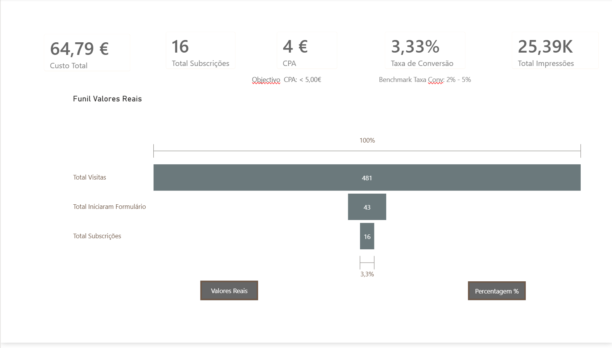

# 🎸 Ecos Progressivos — Marketing Performance Analytics

[🌐 Visitar o site Ecos Progressivos](https://ecosprogressivos.carrd.co/)

## Sobre o Projeto

Projeto end-to-end de **Marketing Analytics** desenvolvido para analisar uma campanha real de captação de subscritores para uma newsletter dedicada ao rock progressivo.

O projeto integra dados de **Meta Ads**, **Google Analytics 4** e **Mailchimp**, seguindo um pipeline completo:

```text
Meta Ads + GA4 + Mailchimp → Python ETL → SQL Server → Power BI
```

Os dados foram importados e tratados em Python, consolidados num formato comum, carregados no SQL Server e utilizados na construção de um dashboard interativo em Power BI.

## Tecnologias

- Python e Pandas
- SQLAlchemy e pyodbc
- SQL Server
- Power BI e DAX
- Meta Ads
- Google Analytics 4
- Mailchimp

## O que foi desenvolvido

- Criação da landing page e da campanha de Meta Ads;
- Recolha de dados através do GA4 e Mailchimp;
- Processo ETL em Python;
- Integração das diferentes fontes num modelo vertical;
- Carregamento dos dados no SQL Server;
- Criação de medidas DAX;
- Construção do dashboard em Power BI;
- Análise do funil e desenvolvimento de recomendações.

## Resultados Principais

| Indicador | Resultado |
|---|---:|
| Investimento em Meta Ads | 64,79 € |
| Impressões | 25 386 |
| Alcance | 16 338 |
| Sessões no website | 532 |
| Novos utilizadores | 481 |
| Inícios de formulário | 43 |
| Subscrições confirmadas | 16 |
| Taxa de conversão por sessão | 3,01% |
| Custo por resultado Meta | 9,26 € |
| Custo global por subscrição | 4,05 € |

## Funil de Conversão

```text
532 Sessões
     ↓
43 Inícios de formulário
     ↓
16 Subscrições confirmadas
```

A maior perda ocorreu antes do início do formulário: apenas **8,08% das sessões** avançaram para essa etapa.

Entre os 43 inícios de formulário e as 16 subscrições confirmadas, o rácio foi de **37,21%**.

## Dashboard

O dashboard apresenta os principais KPIs da campanha e permite alternar entre valores absolutos e percentagens do funil.



## Principais Recomendações

- Implementar parâmetros UTM consistentes;
- Validar eventos como `form_submit` e `sign_up`;
- Melhorar a visibilidade e simplicidade do formulário;
- Otimizar a experiência em dispositivos móveis;
- Realizar testes A/B na landing page;
- Testar Google Search como canal baseado na intenção de pesquisa.

## Limitações

As plataformas utilizam diferentes métodos de medição e atribuição. Por esse motivo, os 7 resultados atribuídos pela Meta não são diretamente equivalentes às 16 subscrições confirmadas no Mailchimp.

Os inícios de formulário representam eventos do GA4 e não necessariamente utilizadores únicos.

## Conclusão

O projeto demonstra a integração de dados de marketing num pipeline completo, desde a recolha e transformação até ao armazenamento, visualização e interpretação.

A análise mostrou que melhorar a campanha não depende apenas de gerar mais tráfego, mas também de otimizar a landing page, o formulário e a qualidade da medição.
